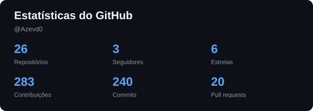
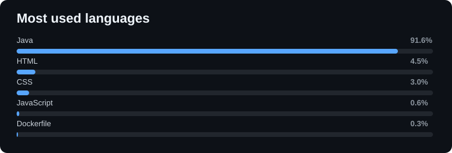
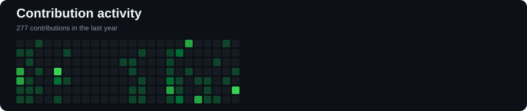

# Davyson de Azevedo

### Desenvolvedor Backend Java • Estudante de Análise e Desenvolvimento de Sistemas

  
  

---

<table>
<tr>
<td width="58%" valign="top">

## Sobre mim

Sou **Desenvolvedor Backend Java** e estudante de **Análise e Desenvolvimento de Sistemas**.

Meu principal foco é o desenvolvimento de aplicações backend e APIs REST utilizando **Java, Spring Boot, JPA/Hibernate e PostgreSQL**.

Também trabalho com **segurança de aplicações, testes automatizados, Docker, tecnologias de nuvem e infraestrutura local**, buscando sempre compreender todo o processo, desde o código até sua execução.

### Atualmente focado em

- ☕ Java & Spring Boot
- 🔗 REST APIs
- 🗄️ PostgreSQL, JPA & Hibernate
- 🔐 Spring Security & JWT
- 🐳 Docker & Docker Compose
- ☁️ AWS
- 🧪 JUnit & Mockito
- ⚡ Redis
- 📖 OpenAPI / Swagger
- 🐧 Linux

</td>

<td width="42%" valign="top">

## 🧰 Stack Tecnológica

 

### Desenvolvimento

`Java` • `Spring Boot` • `REST` • `Maven`

### Dados

`PostgreSQL` • `JPA` • `Hibernate` • `Redis`

### Infraestrutura

`Docker` • `Docker Compose` • `AWS` • `Linux`

</td>
</tr>
</table>

---

# 📊 Dashboard do GitHub

 

---

# 🚀 Projetos em Destaque

<table>
<tr>
<td width="50%" valign="top">

### 🔗 [JReqs](https://github.com/Azevd0/JReqs)

Um cliente de API desenvolvido em Java e inspirado no **Postman**, projetado para enviar requisições HTTP diretamente pelo terminal.

Construído utilizando a API HTTP do Java e Jakarta JSON, com uma arquitetura modular baseada no sistema de módulos do Java.

**Tecnologias**

`Java` · `java.net.http` · `Jakarta JSON` · `Java Modules`

</td>

<td width="50%" valign="top">

### ☁️ [Calendar](https://github.com/Azevd0/Calendar)

Contribuição em um projeto desenvolvido para gerenciamento e organização de eventos e compromissos em um calendário.

O projeto busca oferecer uma estrutura para criação, consulta e gerenciamento de eventos de forma organizada.

**Tecnologias**

`Java` · `Spring Boot` · `PostgreSQL` · `Docker` · `Flutter` · `TypeScript` · `Angular`

</td>
</tr>

<tr>
<td width="50%" valign="top">

### 🍔 [My Order Factory](https://github.com/Azevd0/MyOrderFactory)

Backend para gerenciamento de restaurantes, com foco em usuários, gerenciamento de cardápio, pedidos, pagamentos, controle de acesso e relatórios financeiros.

O projeto também explora cache, infraestrutura conteinerizada e compilação nativa.

**Tecnologias**

`Java 21+` · `Spring Boot` · `Spring Security` · `PostgreSQL` · `Redis` · `Docker` · `GraalVM`

</td>

<td width="50%" valign="top">

### 🔒 [Cadastro de Usuário](https://github.com/Azevd0/Cadastro-de-Usuario)

API REST para gerenciamento de usuários, permitindo realizar operações de cadastro, consulta, atualização e exclusão de dados.

O projeto utiliza uma arquitetura baseada em API REST e explora recursos de criptografia, autenticação e serviços de nuvem.

**Tecnologias**

`Java` · `Spring Boot` · `Spring Data JPA` · `Hibernate` · `PostgreSQL` · `Docker` · `AWS`

</td>
</tr>
</table>
---

<i>Sempre aprendendo. Sempre construindo.</i>

